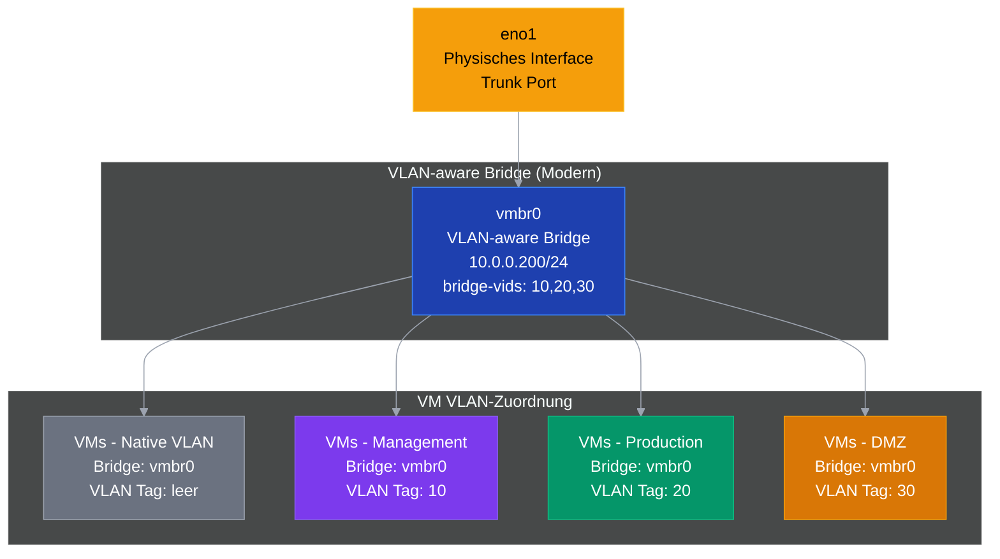

# Proxmox VE Installation & Konfiguration - Homeserver Optimiert
*Enterprise-Grade Setup mit VLAN-aware Bridge und Security Hardening*

```
# GUI Setup via USB
- ext4
- swapsize 8GB
- maxroot 32GB
- minfree 10GB
- maxvz freilassen 
```

## 📋 Inhaltsverzeichnis

1. [Initial Setup](#initial-setup)
2. [Netzwerk-Architektur](#netzwerk-architektur)
3. [UniFi Netzwerk-Konfiguration](#unifi-netzwerk-konfiguration)
4. [Proxmox Netzwerk-Setup](#proxmox-netzwerk-setup)
5. [Benutzer-Management](#benutzer-management)
6. [SSH-Konfiguration](#ssh-konfiguration)
7. [Security Hardening](#security-hardening)
8. [Firewall & Monitoring](#firewall--monitoring)

---

## Initial Setup

### Proxmox VE Post-Install Skripts

```bash
# Intel e1000e NIC Offloading Fix
bash -c "$(curl -fsSL https://raw.githubusercontent.com/community-scripts/ProxmoxVE/main/tools/pve/nic-offloading-fix.sh)"

# Proxmox VE Post Install
bash -c "$(curl -fsSL https://raw.githubusercontent.com/community-scripts/ProxmoxVE/main/tools/pve/post-pve-install.sh)"
```

---

## Netzwerk-Architektur

### Überblick der Netzwerk-Segmentierung

Die Infrastruktur verwendet eine moderne **VLAN-aware Bridge** für optimale Performance und einfache Verwaltung:

**IP-Adressbereiche:**
- **VLAN 1 (Native)**: `10.0.0.0/24` - Home/Management LAN
- **VLAN 10**: `10.10.0.0/24` - Management Network
- **VLAN 20**: `10.20.0.0/24` - Production/Server Network  
- **VLAN 30**: `10.30.0.0/24` - DMZ Network

### Moderne VLAN-aware Architektur



---

## UniFi Netzwerk-Konfiguration

### 1. VLAN-Netzwerke erstellen

#### VLAN 10 - Management Network

**Navigation:** Settings → Networks → Create New Network

| Parameter | Wert |
|-----------|------|
| Name | `VLAN 10 - Management` |
| Network Type | `Standard` |
| Router | `Security Gateway` |
| VLAN ID | `10` |
| Gateway/Subnet | `10.10.0.1/24` |
| DHCP Mode | `DHCP Server` |
| DHCP Range | `10.10.0.100 - 10.10.0.200` |

#### VLAN 20 - Server/Production Network

| Parameter | Wert |
|-----------|------|
| Name | `VLAN 20 - Server` |
| Network Type | `Standard` |
| Router | `Security Gateway` |
| VLAN ID | `20` |
| Gateway/Subnet | `10.20.0.1/24` |
| DHCP Mode | `DHCP Server` |
| DHCP Range | `10.20.0.100 - 10.20.0.200` |

#### VLAN 30 - DMZ Network

| Parameter | Wert |
|-----------|------|
| Name | `VLAN 30 - DMZ` |
| Network Type | `Standard` |
| Router | `Security Gateway` |
| VLAN ID | `30` |
| Gateway/Subnet | `10.30.0.1/24` |
| DHCP Mode | `DHCP Server` |
| DHCP Range | `10.30.0.100 - 10.30.0.200` |

### 2. Switch-Port-Profil konfigurieren

**Navigation:** Settings → Profiles → Switch Ports

#### Proxmox-Trunk Profil erstellen

| Parameter | Wert |
|-----------|------|
| Name | `Proxmox-Trunk` |
| Port Type | `Trunk` |
| Native VLAN/Network | `10.0.0/24 - Home - LAN (1)` |
| Tagged VLANs | `VLAN 10`, `VLAN 20`, `VLAN 30` |

### 3. Switch-Port zuweisen

**Navigation:** UniFi Devices → [Switch Name] → Ports Tab

1. Proxmox Host Port auswählen (z.B. wo `eno1` angeschlossen ist)
2. Profil `Proxmox-Trunk` zuweisen
3. Zusätzliche Einstellungen:
   - Port Isolation: **deaktiviert**
   - Storm Control: **aktiviert**
   - LLDP-MED: **aktiviert**
   - Spanning Tree Protocol: **aktiviert**

---

## Proxmox Netzwerk-Setup

### System-Vorbereitung

```bash
# System aktualisieren
apt update && apt upgrade -y

# Erforderliche Pakete installieren
apt install ufw git python3 python3-pip fail2ban sudo bridge-utils -y

# VLAN-Support sicherstellen
echo "8021q" > /etc/modules-load.d/vlan.conf
modprobe 8021q
lsmod | grep 8021q
```

### ⚡ **Moderne VLAN-aware Bridge Konfiguration**

```bash
# Backup der Original-Konfiguration
cp /etc/network/interfaces /etc/network/interfaces.backup.$(date +%Y%m%d_%H%M%S)

# Moderne VLAN-aware Bridge Konfiguration
cat > /etc/network/interfaces << 'EOF'
auto lo
iface lo inet loopback

# Physisches Interface - Trunk Port (keine IP)
iface eno1 inet manual

# VLAN-aware Bridge - Enterprise Standard
auto vmbr0
iface vmbr0 inet static
        address 10.0.0.200/24
        gateway 10.0.0.1
        bridge-ports eno1
        bridge-stp off
        bridge-fd 0
        bridge-vlan-aware yes
        bridge-vids 10,20,30

source /etc/network/interfaces.d/*
EOF

# Netzwerk-Konfiguration sofort anwenden
systemctl restart networking

# Netzwerk-Status prüfen
ip addr show vmbr0
bridge vlan show
```

---

## Benutzer-Management

### Root-Passwort sichern

```bash
# Starkes Root-Passwort setzen (für Notfälle)
passwd root
# Verwende ein starkes, eindeutiges Passwort und dokumentiere es sicher
```

### Linux-Benutzer erstellen mit Proxmox-Integration

```bash
# Benutzer mit Home-Verzeichnis anlegen
useradd -m -d /home/erik -s /bin/bash erik

# Starkes Passwort setzen
passwd erik

# Sudo-Berechtigung gewähren
usermod -aG sudo erik

# Erik zu www-data Gruppe hinzufügen (für /etc/pve/ Zugriff)
usermod -aG www-data erik

# WICHTIG: Sudo-Konfiguration für Proxmox-Befehle
# Dies erlaubt erik, alle Befehle ohne Passwort auszuführen
echo "erik ALL=(ALL) NOPASSWD:ALL" > /etc/sudoers.d/erik
chmod 440 /etc/sudoers.d/erik

# PATH für Proxmox-Tools erweitern und Enterprise-Aliase einrichten
cat >> /home/erik/.bashrc << 'EOF'

# Proxmox Tools im PATH
export PATH=$PATH:/usr/sbin:/sbin

# ============================================================================
# PROXMOX MANAGEMENT ALIASES - Enterprise Standard
# ============================================================================
# WICHTIG: Proxmox-Befehle erfordern sudo-Rechte für IPC-Kommunikation.
# Diese Aliase bieten die professionelle Arbeitsweise für Proxmox-Administration.

# VM Management
alias qm='sudo qm'
alias vmlist='sudo qm list'
alias vmstart='sudo qm start'
alias vmstop='sudo qm stop'
alias vmstatus='sudo qm status'
alias vmreboot='sudo qm reboot'
alias vmshutdown='sudo qm shutdown'
alias vmreset='sudo qm reset'
alias vmmonitor='sudo qm monitor'
alias vmconfig='sudo qm config'
alias vmclone='sudo qm clone'
alias vmcreate='sudo qm create'
alias vmdestroy='sudo qm destroy'

# Container Management (LXC)
alias pct='sudo pct'
alias ctlist='sudo pct list'
alias ctstart='sudo pct start'
alias ctstop='sudo pct stop'
alias ctstatus='sudo pct status'
alias ctenter='sudo pct enter'
alias ctconfig='sudo pct config'

# User & Permission Management
alias pveum='sudo pveum'
alias userlist='sudo pveum user list'
alias grouplist='sudo pveum group list'
alias rolelist='sudo pveum role list'
alias useradd='sudo pveum user add'
alias userdel='sudo pveum user delete'
alias usermod='sudo pveum user modify'
alias acllist='sudo pveum acl list'

# System Management
alias pveversion='sudo pveversion'
alias pvestatus='sudo systemctl status pvedaemon pveproxy pve-cluster --no-pager'
alias pverestart='sudo systemctl restart pvedaemon pveproxy'
alias pvelog='sudo journalctl -u pvedaemon -f'
alias pveupdate='sudo apt update && sudo apt dist-upgrade'

# Storage Management
alias pvesm='sudo pvesm'
alias storagelist='sudo pvesm status'
alias storageadd='sudo pvesm add'

# Backup Management
alias vzdump='sudo vzdump'
alias backuplist='sudo vzdump --dumpdir /var/lib/vz/dump'

# Network Management
alias bridgelist='brctl show'
alias vlanshow='bridge vlan show'
alias netstat='sudo netstat -tulpn'

# Quick System Info
alias pveinfo='echo "=== PROXMOX SYSTEM INFO ===" && sudo pveversion -v && echo && echo "=== VMs ===" && sudo qm list && echo && echo "=== CONTAINERS ===" && sudo pct list && echo && echo "=== STORAGE ===" && sudo pvesm status'

EOF

# .bashrc für erik neu laden
chown erik:erik /home/erik/.bashrc
```

### Proxmox PAM-Integration

```bash
# Benutzer in Proxmox registrieren
pveum user add erik@pam

# Administrator-Rechte gewähren
pveum acl modify / -user erik@pam -role Administrator
```

### 💡 **Enterprise-Proxmox-Arbeitsweise**

```bash
# Als erik einloggen und testen
su - erik

# Jetzt funktionieren alle Proxmox-Befehle über Aliase:
vmlist                 # = sudo qm list (zeigt alle VMs)
userlist              # = sudo pveum user list (zeigt alle Benutzer)
pveinfo               # Kompletter System-Überblick
storagelist           # Storage-Status

# VM-Management-Beispiele:
vmstart 100           # Startet VM 100
vmstop 100            # Stoppt VM 100
vmstatus 100          # Status von VM 100

# Container-Management:
ctlist                # Alle Container anzeigen
ctstart 101           # Container 101 starten

# System-Management:
pvestatus             # Status aller Proxmox-Services
pvelog                # Live-Logs verfolgen

# Logout von erik
exit
```
### 📊 **Verfügbare Alias-Kategorien**

| Kategorie | Anzahl | Beispiele |
|-----------|--------|-----------|
| **VM Management** | 12 | `vmlist`, `vmstart`, `vmstop`, `vmconfig` |
| **Container (LXC)** | 7 | `ctlist`, `ctstart`, `ctenter` |
| **Benutzer-Verwaltung** | 8 | `userlist`, `useradd`, `grouplist` |
| **System-Management** | 6 | `pveinfo`, `pvestatus`, `pvelog` |
| **Storage & Backup** | 4 | `storagelist`, `backuplist` |
| **Netzwerk** | 3 | `bridgelist`, `vlanshow` |

**🏠 Das System bietet jetzt professionelle Proxmox-Administration mit Enterprise-Sicherheit und Homeserver-Komfort!**

---

## SSH-Konfiguration

### SSH-Keys generieren (Windows)

```powershell
# SSH-Verzeichnis erstellen
mkdir $env:USERPROFILE\.ssh

# ED25519 Key generieren
ssh-keygen -t ed25519 -C "erik@pve" -f "$env:USERPROFILE\.ssh\proxmox_ed25519"

# Public Key auf Server übertragen
cat $env:USERPROFILE\.ssh\proxmox_ed25519.pub | ssh erik@10.0.0.200 "mkdir -p ~/.ssh && chmod 700 ~/.ssh && cat >> ~/.ssh/authorized_keys && chmod 600 ~/.ssh/authorized_keys"
```

### SSH-Client Konfiguration

```powershell
# SSH-Konfigurationsdatei erstellen
$sshConfig = @"
Host proxmox
    HostName 10.0.0.200
    User erik
    Port 22
    IdentityFile $env:USERPROFILE\.ssh\proxmox_ed25519
    IdentitiesOnly yes
"@

$sshConfig | Out-File -FilePath "$env:USERPROFILE\.ssh\config" -Encoding UTF8
```

---

## Security Hardening

### 🔐 System-Basis-Härtung

#### 1. IPv6 deaktivieren (Angriffsfläche reduzieren)

```bash
# IPv6 systemweit deaktivieren
echo 'net.ipv6.conf.all.disable_ipv6 = 1' | sudo tee -a /etc/sysctl.conf
echo 'net.ipv6.conf.default.disable_ipv6 = 1' | sudo tee -a /etc/sysctl.conf
echo 'net.ipv6.conf.lo.disable_ipv6 = 1' | sudo tee -a /etc/sysctl.conf
sudo sysctl -p

# GRUB-Konfiguration aktualisieren
sudo sed -i 's/GRUB_CMDLINE_LINUX_DEFAULT="quiet"/GRUB_CMDLINE_LINUX_DEFAULT="quiet ipv6.disable=1"/' /etc/default/grub
sudo update-grub
```

#### 2. Kernel-Parameter-Härtung

```bash
# Netzwerk-Sicherheit
sudo tee -a /etc/sysctl.conf << 'EOF'

# Network Security Hardening
net.ipv4.conf.all.send_redirects = 0
net.ipv4.conf.default.send_redirects = 0
net.ipv4.conf.all.accept_redirects = 0
net.ipv4.conf.default.accept_redirects = 0
net.ipv4.conf.all.secure_redirects = 0
net.ipv4.conf.default.secure_redirects = 0
net.ipv4.conf.all.accept_source_route = 0
net.ipv4.conf.default.accept_source_route = 0
net.ipv4.conf.all.log_martians = 1
net.ipv4.conf.default.log_martians = 1
net.ipv4.icmp_echo_ignore_broadcasts = 1
net.ipv4.icmp_ignore_bogus_error_responses = 1
net.ipv4.tcp_syncookies = 1
net.ipv4.ip_forward = 1

# Memory Protection
kernel.dmesg_restrict = 1
kernel.kptr_restrict = 2
kernel.yama.ptrace_scope = 1

# File System Protection
fs.protected_hardlinks = 1
fs.protected_symlinks = 1
fs.suid_dumpable = 0
EOF

sudo sysctl -p
```

### 🔒 Enterprise SSH-Härtung (Security Level: 96/100)

#### 1. Konfigurationssicherung

```bash
# Backup erstellen
sudo mkdir -p /etc/ssh/backups
sudo cp /etc/ssh/sshd_config /etc/ssh/backups/sshd_config.backup.$(date +%Y%m%d_%H%M%S)
```

#### 2. Enterprise SSH-Konfiguration

```bash
sudo tee /etc/ssh/sshd_config.d/99-security-hardening.conf << 'EOF'
# =============================================================================
# SSH Security Hardening Configuration - Enterprise Standards 2025
# =============================================================================

# Network Configuration
Port 62222
AddressFamily inet
ListenAddress 0.0.0.0

# Protocol and Encryption
Protocol 2

# Host Keys - Nur moderne Algorithmen
HostKey /etc/ssh/ssh_host_rsa_key
HostKey /etc/ssh/ssh_host_ed25519_key

# Key Exchange Algorithms - Nur sichere moderne Algorithmen
KexAlgorithms curve25519-sha256,curve25519-sha256@libssh.org,diffie-hellman-group16-sha512,diffie-hellman-group18-sha512

# Cipher Algorithms - Nur AEAD und sichere Verschlüsselung
Ciphers chacha20-poly1305@openssh.com,aes256-gcm@openssh.com,aes128-gcm@openssh.com,aes256-ctr,aes192-ctr,aes128-ctr

# MAC Algorithms - Nur ETM (Encrypt-then-MAC)
MACs hmac-sha2-256-etm@openssh.com,hmac-sha2-512-etm@openssh.com

# Public Key Algorithms
PubkeyAcceptedAlgorithms ssh-ed25519,ssh-rsa,ecdsa-sha2-nistp256,ecdsa-sha2-nistp384,ecdsa-sha2-nistp521

# =============================================================================
# Authentication Configuration
# =============================================================================

# Root Access - Komplett deaktiviert
PermitRootLogin no

# User Authentication
AllowUsers erik
DenyUsers root
DenyGroups root

# Public Key Authentication - Erforderlich
PubkeyAuthentication yes
AuthorizedKeysFile .ssh/authorized_keys .ssh/authorized_keys2

# Password Authentication - Deaktiviert
PasswordAuthentication no
PermitEmptyPasswords no
ChallengeResponseAuthentication no
KbdInteractiveAuthentication no
UsePAM no

# =============================================================================
# Session Configuration
# =============================================================================

# Connection Limits
MaxAuthTries 3
MaxSessions 5
MaxStartups 3:30:10

# Session Timeouts
ClientAliveInterval 300
ClientAliveCountMax 2
LoginGraceTime 30

# =============================================================================
# Feature Restrictions
# =============================================================================

# Security Features
X11Forwarding no
AllowTcpForwarding local
AllowStreamLocalForwarding no
GatewayPorts no
AllowAgentForwarding no
PermitTunnel no
PermitUserEnvironment no

# =============================================================================
# Logging and Monitoring
# =============================================================================

SyslogFacility AUTHPRIV
LogLevel VERBOSE
Banner /etc/ssh/ssh_banner.txt

# =============================================================================
# Additional Security
# =============================================================================

StrictModes yes
Compression no
TCPKeepAlive yes
UseDNS no
PrintMotd no
PrintLastLog yes

Subsystem sftp /usr/lib/openssh/sftp-server -f AUTHPRIV -l INFO

GSSAPIAuthentication no
HostbasedAuthentication no
IgnoreUserKnownHosts yes
RequiredRSASize 2048
DebianBanner no
EOF
```

#### 3. Sicherheitsbanner

```bash
sudo tee /etc/ssh/ssh_banner.txt << 'EOF'

  ################################################################################
  #                                                                              #
  #                           AUTHORIZED ACCESS ONLY                             #
  #                                                                              #
  #  This system is for authorized users only. All activities may be             #
  #  monitored and recorded. By accessing this system, you acknowledge           #
  #  that you have no reasonable expectation of privacy.                         #
  #                                                                              #
  #  Unauthorized access is strictly prohibited and may be subject to            #
  #  criminal and civil penalties.                                               #
  #                                                                              #
  ################################################################################

EOF
```

#### 4. Starke Host-Keys generieren

```bash
# Bestehende Keys sichern
sudo cp -r /etc/ssh /etc/ssh.backup

# Schwache Keys entfernen
sudo rm -f /etc/ssh/ssh_host_dsa_key*
sudo rm -f /etc/ssh/ssh_host_ecdsa_key*

# Neue starke Keys generieren
sudo ssh-keygen -t rsa -b 4096 -f /etc/ssh/ssh_host_rsa_key -N ""
sudo ssh-keygen -t ed25519 -f /etc/ssh/ssh_host_ed25519_key -N ""

# Berechtigungen setzen
sudo chmod 600 /etc/ssh/ssh_host_*_key
sudo chmod 644 /etc/ssh/ssh_host_*_key.pub
```

#### 5. Konfiguration aktivieren

```bash
# Konfiguration testen
sudo sshd -t

# SSH-Service neu laden
sudo systemctl reload sshd

# Status prüfen
sudo systemctl status sshd
sudo ss -tlnp | grep :62222
```

---

## Firewall & Monitoring

### 🛡️ UFW Firewall-Konfiguration

#### 1. Grundkonfiguration

```bash
# UFW IPv6 deaktivieren (bereits durch System-Härtung deaktiviert)
sudo sed -i 's/IPV6=yes/IPV6=no/' /etc/default/ufw

# Standard-Richtlinien (Default Deny)
sudo ufw default deny incoming
sudo ufw default allow outgoing
sudo ufw default deny forward
```

#### 2. Lokale Services (LAN-Zugriff)

```bash
# SSH (gehärtet) - Nur aus lokalem Netzwerk
sudo ufw allow from 10.0.0.0/16 to any port 62222 proto tcp comment 'SSH Hardened - LAN only'

# Proxmox WebUI - Nur aus lokalem Netzwerk
sudo ufw allow from 10.0.0.0/16 to any port 8006 proto tcp comment 'Proxmox WebUI - LAN only'
```

#### 3. VM-Bridge-Traffic Regeln (Detaillierte Erklärung)

```bash
# ============================================================================
# VM-BRIDGE TRAFFIC KONTROLLE
# Diese Regeln erlauben eingehenden Traffic von VMs in verschiedenen VLANs
# zur Bridge vmbr0. Dies ist notwendig, damit VMs untereinander und mit dem
# Proxmox-Host kommunizieren können.
# ============================================================================

# Native VLAN (10.0.0.0/24) - Home/Management LAN
# Erlaubt: VMs im Home-Netzwerk können mit dem Host kommunizieren
sudo ufw allow in on vmbr0 from 10.0.0.0/24 comment 'Native VLAN - Erlaubt VM-zu-Host Kommunikation im Home-Netzwerk'

# Management VLAN (10.10.0.0/24) - Verwaltungs-Netzwerk
# Erlaubt: Management-VMs (z.B. Monitoring) können auf den Host zugreifen
sudo ufw allow in on vmbr0 from 10.10.0.0/24 comment 'Management VLAN - Erlaubt Management-VM Zugriff auf Host'

# Production VLAN (10.20.0.0/24) - Produktiv-Server
# Erlaubt: Produktiv-VMs können untereinander kommunizieren (Bridge-Funktion)
sudo ufw allow in on vmbr0 from 10.20.0.0/24 comment 'Production VLAN - Erlaubt Server-VM Traffic über Bridge'

# DMZ VLAN (10.30.0.0/24) - Demilitarisierte Zone
# Erlaubt: DMZ-VMs können nach außen kommunizieren (Internet), aber isoliert von anderen VLANs
sudo ufw allow in on vmbr0 from 10.30.0.0/24 comment 'DMZ VLAN - Erlaubt isolierten DMZ-VM Traffic'

# ============================================================================
# WICHTIG: Diese Regeln erlauben NUR den Traffic VON den VMs ZUR Bridge.
# Die tatsächliche Isolation zwischen VLANs wird durch UniFi-Firewall-Regeln
# auf Router-Ebene gesteuert. Die UFW schützt primär den Proxmox-Host selbst.
# ============================================================================
```

#### 4. Logging und Monitoring

```bash
# UFW Logging aktivieren
sudo ufw logging on

# Firewall aktivieren
sudo ufw --force enable

# Status anzeigen
sudo ufw status verbose
sudo ufw status numbered
```

### 🚫 Fail2Ban Konfiguration

#### 1. SSH-Schutz (Basis)

##### Standard SSH-Jail (Port 62222)

```bash
sudo tee /etc/fail2ban/jail.d/sshd-hardened.conf << 'EOF'
[sshd]
enabled = true
port = 62222
filter = sshd
logpath = /var/log/auth.log
backend = systemd
maxretry = 3
findtime = 600
bantime = 3600
ignoreip = 127.0.0.1/8 10.0.0.0/16
EOF
```

##### Aggressiver SSH-Jail (Schnelle Reaktion)

```bash
sudo tee /etc/fail2ban/jail.d/ssh-aggressive.conf << 'EOF'
[sshd-aggressive]
enabled = true
port = 62222
filter = sshd
logpath = /var/log/auth.log
backend = systemd
maxretry = 6
findtime = 60
bantime = 600
ignoreip = 127.0.0.1/8 10.0.0.0/16
EOF
```

#### 3. Proxmox WebUI Schutz

##### Filter erstellen (wichtig: in filter.d/, nicht jail.d/)

```bash
# Proxmox-spezifischen Filter definieren
sudo tee /etc/fail2ban/filter.d/proxmox.conf << 'EOF'
# Fail2Ban filter for Proxmox VE
[Definition]
failregex = pvedaemon\[.*authentication failure.*rip=<HOST>
            pveproxy\[.*authentication failure.*from <HOST>
            pvedaemon\[.*failed authentication.*IP <HOST>
ignoreregex =
EOF
```

##### Proxmox Jail aktivieren

```bash
sudo tee /etc/fail2ban/jail.d/proxmox.conf << 'EOF'
[proxmox]
enabled = true
port = 8006
filter = proxmox
logpath = /var/log/daemon.log
maxretry = 5
findtime = 300
bantime = 1800
ignoreip = 127.0.0.1/8 10.0.0.0/16
backend = systemd
EOF
```

#### 4. Fail2ban aktivieren und verifizieren

```bash
# Konfiguration testen
sudo fail2ban-client -t

# Service neu laden
sudo fail2ban-client reload

# Status prüfen
sudo fail2ban-client status

# Erwartete Ausgabe:
# Status
# |- Number of jail:      3
# `- Jail list:   proxmox, sshd, sshd-aggressive
```


#### Fail2ban Jail-Übersicht

| Jail | Port | Max Versuche | Zeitfenster | Bann-Dauer | Zweck |
|------|------|--------------|-------------|------------|--------|
| **sshd** | 62222 | 3 | 10 Min | 1 Stunde | Standard SSH-Schutz |
| **sshd-aggressive** | 62222 | 6 | 1 Min | 10 Min | Schnelle Reaktion bei Angriffen |
| **proxmox** | 8006 | 5 | 5 Min | 30 Min | WebUI-Schutz |

#### 5. Fail2Ban aktivieren

```bash
# Service starten und aktivieren
sudo systemctl enable fail2ban
sudo systemctl restart fail2ban

# Neustarten
sudo reboot

# Status prüfen
sudo fail2ban-client status
sudo fail2ban-client status sshd
```

---

## 🌐 Netzwerk-Konfiguration

### **Sicherheitsmaßnahmen**

| Komponente | Status | Security Level |
|------------|---------|----------------|
| System-Basis-Härtung | ✅ Implementiert | Komplett |
| SSH Hardening | ✅ Implementiert | 96/100 |
| VLAN-aware Bridge | ✅ Modern | Enterprise |
| UFW Firewall | ✅ Restriktiv | Defense-in-Depth |
| Fail2Ban | ✅ Mehrstufig | Aggressiv |
| IPv6 Deaktivierung | ✅ Systemweit | Komplett |
| Root-Passwort | ✅ Gehärtet | Notfall-Zugang |
| Key-only Authentication | ✅ Erzwungen | Obligatorisch |

### **Netzwerk-Ports & Services**

| Service | Port | Zugriff | Protokoll | Zweck |
|---------|------|---------|-----------|--------|
| SSH (gehärtet) | 62222 | LAN only | TCP | Sichere Administration |
| Proxmox WebUI | 8006 | LAN only | HTTPS | Management Interface |
| Standard SSH | 22 | ❌ Deaktiviert | - | Sicherheitsrisiko |

---

## ✅ **Finale Checkliste**

- [ ] Proxmox Post-Install Skripts ausgeführt
- [ ] UniFi Switch-Port als Trunk konfiguriert  
- [ ] VLAN-aware Bridge `vmbr0` eingerichtet
- [ ] `bridge vlan show` zeigt korrekte VLAN-Tags
- [ ] Benutzer `erik` erstellt und konfiguriert
- [ ] PATH für Proxmox-Tools erweitert
- [ ] SSH gehärtet auf Port 62222
- [ ] UFW Firewall aktiviert und konfiguriert
- [ ] Fail2Ban für SSH-Schutz aktiv
- [ ] Proxmox WebUI erreichbar (`https://10.0.0.200:8006`)
- [ ] SSH-Verbindung funktioniert (`ssh erik@10.0.0.200 -p 62222`)
- [ ] Proxmox-Befehle als erik ausführbar (`qm list`, `pveum user list`)

---

## 🎯 **Warum diese Konfiguration perfekt für Homeserver ist**

### **Vorteile für Homeserver-Betrieb:**

1. **Einfache Wartung**: Eine einzige VLAN-aware Bridge statt komplexer Multi-Bridge-Setups
2. **Skalierbarkeit**: Neue VLANs können jederzeit ohne Neustart hinzugefügt werden
3. **Performance**: Direkter Bridge-Traffic ohne zusätzliche Hops
4. **Sicherheit**: Enterprise-Level Security ohne Overhead
5. **Benutzerfreundlichkeit**: Erik kann alle Befehle ohne ständige Root-Logins ausführen

### **Spezielle Homeserver-Optimierungen:**

- **Keine unnötigen Cluster-Ports**: Reduzierte Angriffsfläche
- **Vereinfachtes Benutzer-Management**: Ein Power-User (erik) mit vollen Rechten
- **Praktische Aliase**: Schneller Zugriff auf häufige VM-Operationen
- **Dokumentierte Firewall-Regeln**: Verständlich erklärt für einfache Anpassungen

### **Tipps für den täglichen Betrieb:**

```bash
# Als erik eingeloggt - Häufige Befehle:

# VM-Verwaltung
vmlist                    # Alle VMs anzeigen
vmstart 100              # VM 100 starten
vmstop 100               # VM 100 stoppen
vmstatus 100             # Status von VM 100

# Proxmox-Status
pveversion               # Version anzeigen
sudo pvecm status        # Cluster-Status (auch als Standalone)
sudo systemctl status pveproxy  # WebUI-Status

# Netzwerk-Debugging
ip addr show vmbr0       # Bridge-Status
bridge vlan show         # VLAN-Konfiguration
sudo ufw status numbered # Firewall-Regeln

# Logs prüfen
sudo journalctl -xe      # System-Logs
sudo fail2ban-client status sshd  # SSH-Angriffe
```

**🏠 Das System ist jetzt optimal für deinen Homeserver konfiguriert mit professioneller Sicherheit und einfacher Bedienung!**

*Dokumentation erstellt am: $(date)*Proxmox VLAN-Setup**

Nach dem erfolgreichen Setup der VLAN-aware Bridge sind noch wenige Konfigurationsschritte in der Proxmox WebUI erforderlich.

#### **Proxmox WebUI: VM-Netzwerk-Zuordnung**

**Zugriff:** `https://10.0.0.200:8006`

Für neue VMs die Netzwerk-Konfiguration folgendermaßen vornehmen:

| VLAN | Zweck | Bridge | VLAN Tag | Netzwerk |
|------|-------|--------|----------|----------|
| Native | Home/Management | `vmbr0` | `leer` | 10.0.0.0/24 |
| 10 | Management | `vmbr0` | `10` | 10.10.0.0/24 |
| 20 | Production | `vmbr0` | `20` | 10.20.0.0/24 |
| 30 | DMZ | `vmbr0` | `30` | 10.30.0.0/24 |

**VM-Netzwerk-Einstellungen:**
- **Model:** `VirtIO (paravirtualized)` (beste Performance)
- **Bridge:** Immer `vmbr0`
- **VLAN Tag:** Je nach gewünschtem Netzwerk-Segment

#### **CLI-basierte VM-Netzwerk-Konfiguration**

```bash
# Bestehende VMs auf VLANs verteilen
qm set 100 -net0 virtio,bridge=vmbr0,tag=10  # Management VLAN
qm set 101 -net0 virtio,bridge=vmbr0,tag=20  # Production VLAN
qm set 102 -net0 virtio,bridge=vmbr0,tag=30  # DMZ VLAN
qm set 103 -net0 virtio,bridge=vmbr0         # Native VLAN (ohne Tag)

# Neue VM mit mehreren Netzwerk-Interfaces
qm set 104 -net0 virtio,bridge=vmbr0,tag=20 -net1 virtio,bridge=vmbr0,tag=10
```

### **UniFi Switch-Konfiguration verifizieren**

**Navigation:** UniFi Controller → Devices → [Switch] → Ports

**Proxmox Port-Konfiguration prüfen:**
- **Port Profile:** `Proxmox-Trunk`
- **Port Type:** `Trunk`
- **Native VLAN:** `1 (Home)`
- **Tagged VLANs:** `10, 20, 30`
- **Storm Control:** ✅ Aktiviert
- **Spanning Tree:** ✅ Aktiviert

---

## 🔍 **Konfiguration verifizieren**

```bash
# Bridge-Status anzeigen
brctl show

# VLAN-Konfiguration prüfen
bridge vlan show

# Netzwerk-Status
ip addr show vmbr0
ip route show

# Netzwerk-Tests
ping -c 3 10.0.0.1    # Gateway erreichbar
ping -c 3 8.8.8.8     # Internet erreichbar
```

### **Erwartete Ausgabe:**

```bash
# brctl show sollte zeigen:
bridge name     bridge id               STP enabled     interfaces
vmbr0           8000.xxxxxxxxxxxx       no              eno1

# bridge vlan show sollte zeigen:
port              vlan-id
eno1              1 PVID Egress Untagged
                 10
                 20  
                 30
vmbr0             1 PVID Egress Untagged
                 10
                 20
                 30
```

---

## 📊 **Optimierte Konfigurationsübersicht**

### **Architektur-Verbesserungen**

| Aspekt | Alte Konfiguration | ✅ Neue Optimierung |
|--------|-------------------|---------------------|
| Bridge-Typ | Separate VLANs + Sub-Interfaces | VLAN-aware Bridge |
| Komplexität | Hoch (mehrere Bridges) | Niedrig (eine Bridge) |
| Performance | Mehrere Network Hops | Optimiert, direkt |
| Wartung | Komplex, fehleranfällig | Einfach, robust |
| Persistenz | Zusätzliche Services | Native Linux Networking |
| Enterprise Standard | ❌ Veraltet | ✅ Modern |

### **
