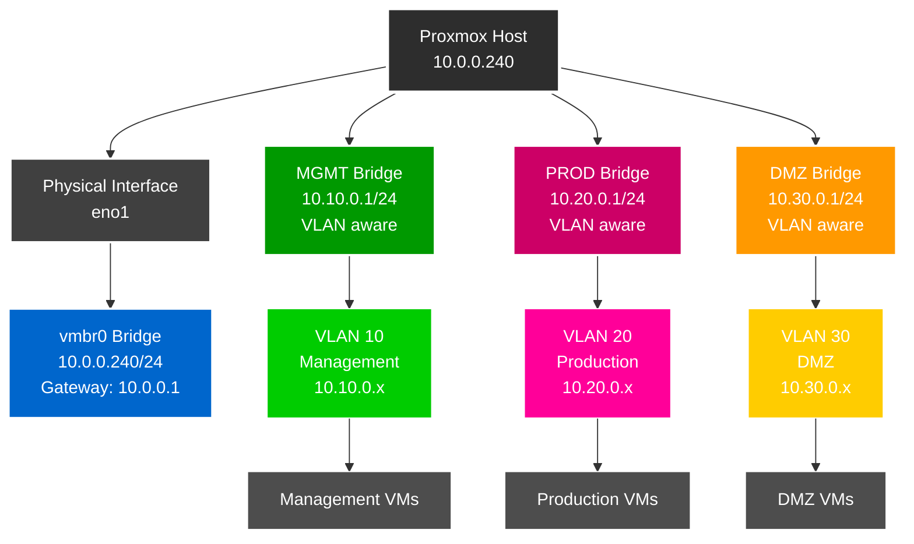

# Proxmox VE Setup Guide

## Inhaltsverzeichnis

1. [Überblick](#überblick)
2. [Netzwerkkonfiguration (/etc/network/interfaces)](#netzwerkkonfiguration-etcnetworkinterfaces)
3. [Netzwerk-Schema](#netzwerk-schema)
4. [UniFi Netzwerk- und Switch-Konfiguration](#unifi-netzwerk--und-switch-konfiguration)
5. [Proxmox Netzwerk-Konfiguration über GUI](#proxmox-netzwerk-konfiguration-über-gui)
6. [Admin-Benutzer einrichten](#admin-benutzer-einrichten)
7. [SSH-Zugang einrichten](#ssh-zugang-einrichten)
8. [Wichtige Hinweise](#wichtige-hinweise)
9. [Troubleshooting](#troubleshooting)

## Überblick
Diese Anleitung beschreibt die Einrichtung von Proxmox VE mit einem Admin-Benutzer und VLAN-fähiger Netzwerkkonfiguration.

## Netzwerkkonfiguration (/etc/network/interfaces)

Nach der GUI-Konfiguration wird folgende Konfiguration automatisch generiert:

```bash
# Hauptnetzwerk-Interface (Management)
auto vmbr0
iface vmbr0 inet static
        address 10.0.0.240/24
        gateway 10.0.0.1
        bridge-ports eno1
        bridge-stp off
        bridge-fd 0

# Management VLAN (VLAN 10)
auto MGMT
iface MGMT inet static
        address 10.10.0.1/24
        bridge-ports none
        bridge-stp off
        bridge-fd 0
        bridge-vlan-aware yes
        bridge-vids 10
#MGMT VLAN

# Production VLAN (VLAN 20)
auto PROD
iface PROD inet static
        address 10.20.0.1/24
        bridge-ports none
        bridge-stp off
        bridge-fd 0
        bridge-vlan-aware yes
        bridge-vids 20
#PROD VLAN

# DMZ VLAN (VLAN 30)
auto DMZ
iface DMZ inet static
        address 10.30.0.1/24
        bridge-ports none
        bridge-stp off
        bridge-fd 0
        bridge-vlan-aware yes
        bridge-vids 30
#DMZ VLAN

source /etc/network/interfaces.d/
```

## Netzwerk-Schema



## UniFi Netzwerk- und Switch-Konfiguration

### 1. VLAN-Netzwerke in UniFi erstellen

#### VLAN 10 - Management Network
1. **Settings → Networks** navigieren
2. **Create New Network** klicken
3. **Einstellungen**:
   - **Name**: `VLAN 10 - Management`
   - **Network Type**: `Standard`
   - **Router**: `Security Gateway`
   - **VLAN ID**: `10`
   - **Gateway/Subnet**: `10.10.0.1/24`
   - **DHCP Mode**: `DHCP Server`
   - **DHCP Range**: `10.10.0.100 - 10.10.0.200`
4. **Save** klicken

#### VLAN 20 - Server/Production Network  
1. **Create New Network** klicken
2. **Einstellungen**:
   - **Name**: `VLAN 20 - Server`
   - **Network Type**: `Standard`
   - **Router**: `Security Gateway`
   - **VLAN ID**: `20`
   - **Gateway/Subnet**: `10.20.0.1/24`
   - **DHCP Mode**: `DHCP Server`
   - **DHCP Range**: `10.20.0.100 - 10.20.0.200`
3. **Save** klicken

#### VLAN 30 - DMZ Network
1. **Create New Network** klicken
2. **Einstellungen**:
   - **Name**: `VLAN 30 - DMZ`
   - **Network Type**: `Standard`
   - **Router**: `Security Gateway`
   - **VLAN ID**: `30`
   - **Gateway/Subnet**: `10.30.0.1/24`
   - **DHCP Mode**: `DHCP Server`
   - **DHCP Range**: `10.30.0.100 - 10.30.0.200`
3. **Save** klicken

### 2. Switch-Port-Profil erstellen

1. **Settings → Profiles → Switch Ports** navigieren
2. **Create New Profile** klicken
3. **Profil-Einstellungen**:
   - **Name**: `Proxmox-Trunk`
   - **Port Type**: `Trunk`
   - **Native VLAN/Network**: `10.0.0/24 - Home - LAN (1)`
   - **Tagged VLANs**: 
     - `VLAN 10 - Management`
     - `VLAN 20 - Server`
     - `VLAN 30 - DMZ`

### 3. Switch-Port-Profil anwenden

1. **UniFi Devices → [Switch Name]** auswählen
2. **Ports Tab** öffnen
3. **Port des Proxmox Hosts** auswählen (z.B. Port wo `eno1` angeschlossen ist)
4. **Port-Einstellungen**:
   - **Profile**: `Proxmox-Trunk` auswählen
   - **Port Isolation**: deaktiviert
   - **Storm Control**: aktiviert (empfohlen)
   - **LLDP-MED**: aktiviert
   - **Spanning Tree Protocol**: aktiviert
5. **Apply Changes** klicken

### 4. VLAN-Konfiguration prüfen

Nach der Konfiguration sollten folgende VLANs verfügbar sein:
- **VLAN 1**: Management/Home Network (10.0.0.x) - Native
- **VLAN 10**: Management Network (10.10.0.x) - Tagged
- **VLAN 20**: Production Network (10.20.0.x) - Tagged
- **VLAN 30**: DMZ Network (10.30.0.x) - Tagged

### 5. Port-Status überprüfen

1. **Devices → [Switch] → Ports** 
2. **Port-Status prüfen**:
   - Link Status: Connected
   - Speed: 1 Gbps (oder höher)
   - STP State: Forwarding
   - Tagged VLANs: 10, 20, 30 sichtbar

## Proxmox Netzwerk-Konfiguration über GUI

### 1. Proxmox Web-Interface öffnen
- Browser öffnen und zu `https://10.0.0.240:8006` navigieren
- Mit root-Benutzer anmelden

### 2. Hauptbridge (vmbr0) konfigurieren

1. **Navigation**: `Rechenzentrum → [Hostname] → System → Netzwerk`
2. **vmbr0 bearbeiten** (falls nicht vorhanden, erstellen):
   - **Erstellen → Linux Bridge** klicken
   - **Name**: `vmbr0`
   - **IPv4/CIDR**: `10.0.0.240/24`
   - **Gateway (IPv4)**: `10.0.0.1`
   - **Bridge Ports**: `eno1` (physisches Interface)
   - **VLAN aware**: ☐ (nicht aktivieren für Hauptbridge)
   - **OK** klicken

### 3. Management VLAN Bridge (MGMT) erstellen

1. **Erstellen → Linux Bridge** klicken
2. **Einstellungen**:
   - **Name**: `MGMT`
   - **IPv4/CIDR**: `10.10.0.1/24`
   - **Gateway (IPv4)**: leer lassen
   - **Bridge Ports**: leer lassen
   - **VLAN aware**: ☑ aktivieren
   - **Kommentar**: `Management VLAN 10`
3. **OK** klicken

### 4. Production VLAN Bridge (PROD) erstellen

1. **Erstellen → Linux Bridge** klicken
2. **Einstellungen**:
   - **Name**: `PROD`
   - **IPv4/CIDR**: `10.20.0.1/24`
   - **Gateway (IPv4)**: leer lassen
   - **Bridge Ports**: leer lassen
   - **VLAN aware**: ☑ aktivieren
   - **Kommentar**: `Production VLAN 20`
3. **OK** klicken

### 5. DMZ VLAN Bridge (DMZ) erstellen

1. **Erstellen → Linux Bridge** klicken
2. **Einstellungen**:
   - **Name**: `DMZ`
   - **IPv4/CIDR**: `10.30.0.1/24`
   - **Gateway (IPv4)**: leer lassen
   - **Bridge Ports**: leer lassen
   - **VLAN aware**: ☑ aktivieren
   - **Kommentar**: `DMZ VLAN 30`
3. **OK** klicken

### 6. Konfiguration anwenden

1. **"Änderungen anwenden"** Button oben rechts klicken
2. **Bestätigen** mit "Ja"
3. Warten bis Netzwerk neu gestartet wurde

### 7. VLAN-Konfiguration für VMs

Bei VM-Erstellung oder -Bearbeitung:
1. **Hardware → Netzwerkgerät** auswählen
2. **Bridge**: gewünschte Bridge wählen (MGMT, PROD, DMZ)
3. **VLAN Tag**: entsprechende VLAN-ID eingeben
   - MGMT Bridge: VLAN Tag `10`
   - PROD Bridge: VLAN Tag `20`  
   - DMZ Bridge: VLAN Tag `30`

## Admin-Benutzer einrichten

### 1. Linux-Benutzer erstellen

```bash
# Neuen Linux-Benutzer mit Home-Verzeichnis anlegen
# -m erstellt automatisch ein Home-Verzeichnis (/home/erik)
useradd -m erik

# Passwort für den Linux-Benutzer setzen
passwd erik
```

### 2. Proxmox PAM-User registrieren

```bash
# Benutzer in Proxmox als PAM-User registrieren
# @pam bedeutet: Authentifizierung über das Linux-PAM-System
pveum user add erik@pam

# (Optional) Passwort auch in Proxmox setzen
# Meist nicht nötig, da @pam Passwörter direkt aus Linux verwendet
pveum passwd erik@pam

# Vollzugriff in Proxmox gewähren
# Pfad "/" = Rechte auf gesamte Umgebung
# Rolle "Administrator" = Root-ähnliche Rechte
pveum acl modify / -user erik@pam -role Administrator
```

### 3. GUI-Benutzer einrichten (Alternative)

1. **Datacenter → Berechtigungen → Benutzer**
2. **Hinzufügen**
3. **Benutzer-ID**: `erik@pam`
4. **Bestätigen**
5. **Datacenter → Berechtigungen → Hinzufügen → Benutzer-Berechtigung**
6. **Pfad**: `/` (Root)
7. **Benutzer**: `erik@pam`
8. **Rolle**: `Administrator`

## SSH-Zugang einrichten

### SSH-Keys generieren (Windows)

```powershell
# SSH-Verzeichnis erstellen
mkdir $env:USERPROFILE\.ssh

# ED25519 Key generieren
ssh-keygen -t ed25519 -C "erik@pve" -f "$env:USERPROFILE\.ssh\proxmox_ed25519"

# Public Key in Variable speichern
$pubkey = Get-Content "$env:USERPROFILE\.ssh\proxmox_ed25519.pub"

# Key über SSH übertragen und autorisierte Keys einrichten
ssh erik@10.0.0.240 "mkdir -p ~/.ssh && chmod 700 ~/.ssh && echo '$pubkey' >> ~/.ssh/authorized_keys && chmod 600 ~/.ssh/authorized_keys"
```

### SSH-Config erstellen (Windows)

```powershell
# SSH-Konfiguration erstellen
$sshConfig = @"
Host proxmox
    HostName 10.0.0.240
    User erik
    Port 22
    IdentityFile $env:USERPROFILE\.ssh\proxmox_ed25519
    IdentitiesOnly yes
"@

$sshConfig | Out-File -FilePath "$env:USERPROFILE\.ssh\config" -Encoding UTF8
```

### SSH-Verbindung testen

```bash
# Direkte Verbindung
ssh erik@10.0.0.240

# Über SSH-Config
ssh proxmox
```

## Wichtige Hinweise

- **Backup der Konfiguration**: Vor Änderungen immer `/etc/network/interfaces` sichern
- **Netzwerk-Neustart**: Nach Änderungen `systemctl restart networking` ausführen
- **SSH-Sicherheit**: Passwort-Login in SSH deaktivieren nach Key-Setup
- **Firewall**: Proxmox-Firewall entsprechend konfigurieren

## Troubleshooting

### Netzwerk-Probleme
```bash
# Interface-Status prüfen
ip addr show

# Bridge-Status prüfen
brctl show

# Netzwerk neu starten
systemctl restart networking
```

### Benutzer-Probleme
```bash
# PAM-Benutzer auflisten
pveum user list

# Benutzer-Berechtigungen prüfen
pveum acl list
```
