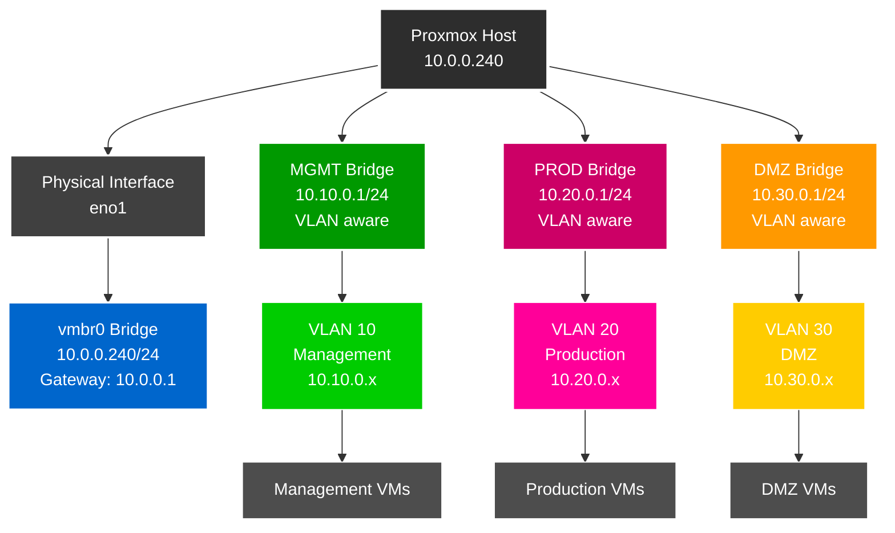

# Proxmox VE Setup Guide

## Inhaltsverzeichnis

1. [Überblick](#überblick)
2. [Netzwerkkonfiguration (/etc/network/interfaces)](#netzwerkkonfiguration-etcnetworkinterfaces)
3. [Netzwerk-Schema](#netzwerk-schema)
4. [UniFi Netzwerk- und Switch-Konfiguration](#unifi-netzwerk--und-switch-konfiguration)
5. [Proxmox Netzwerk-Konfiguration über GUI](#proxmox-netzwerk-konfiguration-über-gui)
6. [Admin-Benutzer einrichten](#admin-benutzer-einrichten)
7. [SSH-Zugang einrichten](#ssh-zugang-einrichten)
8. [SSH-Sicherheit Hardening](#ssh-sicherheit-hardening)
9. [Firewall-Konfiguration](#firewall-konfiguration)
10. [Fail2Ban Setup](#fail2ban-setup)
11. [SSH-Sicherheitsaudit](#ssh-sicherheitsaudit)
12. [Wichtige Hinweise](#wichtige-hinweise)
13. [Troubleshooting](#troubleshooting)

## Überblick
Diese Anleitung beschreibt die Einrichtung von Proxmox VE mit einem Admin-Benutzer und VLAN-fähiger Netzwerkkonfiguration.

## Netzwerkkonfiguration (/etc/network/interfaces)

Nach der GUI-Konfiguration wird folgende Konfiguration automatisch generiert:

## Netzwerk-Schema



## UniFi Netzwerk- und Switch-Konfiguration

### 1. VLAN-Netzwerke in UniFi erstellen

#### VLAN 10 - Management Network
1. **Settings → Networks** navigieren
2. **Create New Network** klicken
3. **Einstellungen**:
   - **Name**: `VLAN 10 - Management`
   - **Network Type**: `Standard`
   - **Router**: `Security Gateway`
   - **VLAN ID**: `10`
   - **Gateway/Subnet**: `10.10.0.1/24`
   - **DHCP Mode**: `DHCP Server`
   - **DHCP Range**: `10.10.0.100 - 10.10.0.200`
4. **Save** klicken

#### VLAN 20 - Server/Production Network  
1. **Create New Network** klicken
2. **Einstellungen**:
   - **Name**: `VLAN 20 - Server`
   - **Network Type**: `Standard`
   - **Router**: `Security Gateway`
   - **VLAN ID**: `20`
   - **Gateway/Subnet**: `10.20.0.1/24`
   - **DHCP Mode**: `DHCP Server`
   - **DHCP Range**: `10.20.0.100 - 10.20.0.200`
3. **Save** klicken

#### VLAN 30 - DMZ Network
1. **Create New Network** klicken
2. **Einstellungen**:
   - **Name**: `VLAN 30 - DMZ`
   - **Network Type**: `Standard`
   - **Router**: `Security Gateway`
   - **VLAN ID**: `30`
   - **Gateway/Subnet**: `10.30.0.1/24`
   - **DHCP Mode**: `DHCP Server`
   - **DHCP Range**: `10.30.0.100 - 10.30.0.200`
3. **Save** klicken

### 2. Switch-Port-Profil erstellen

1. **Settings → Profiles → Switch Ports** navigieren
2. **Create New Profile** klicken
3. **Profil-Einstellungen**:
   - **Name**: `Proxmox-Trunk`
   - **Port Type**: `Trunk`
   - **Native VLAN/Network**: `10.0.0/24 - Home - LAN (1)`
   - **Tagged VLANs**: 
     - `VLAN 10 - Management`
     - `VLAN 20 - Server`
     - `VLAN 30 - DMZ`

### 3. Switch-Port-Profil anwenden

1. **UniFi Devices → [Switch Name]** auswählen
2. **Ports Tab** öffnen
3. **Port des Proxmox Hosts** auswählen (z.B. Port wo `eno1` angeschlossen ist)
4. **Port-Einstellungen**:
   - **Profile**: `Proxmox-Trunk` auswählen
   - **Port Isolation**: deaktiviert
   - **Storm Control**: aktiviert (empfohlen)
   - **LLDP-MED**: aktiviert
   - **Spanning Tree Protocol**: aktiviert
5. **Apply Changes** klicken

### 4. VLAN-Konfiguration prüfen

Nach der Konfiguration sollten folgende VLANs verfügbar sein:
- **VLAN 1**: Management/Home Network (10.0.0.x) - Native
- **VLAN 10**: Management Network (10.10.0.x) - Tagged
- **VLAN 20**: Production Network (10.20.0.x) - Tagged
- **VLAN 30**: DMZ Network (10.30.0.x) - Tagged

### 5. Port-Status überprüfen

1. **Devices → [Switch] → Ports** 
2. **Port-Status prüfen**:
   - Link Status: Connected
   - Speed: 1 Gbps (oder höher)
   - STP State: Forwarding
   - Tagged VLANs: 10, 20, 30 sichtbar

## Proxmox Netzwerk-Konfiguration über GUI

### 1. Proxmox Web-Interface öffnen
- Browser öffnen und zu `https://10.0.0.240:8006` navigieren
- Mit root-Benutzer anmelden

### 2. Hauptbridge (vmbr0) konfigurieren

1. **Navigation**: `Rechenzentrum → [Hostname] → System → Netzwerk`
2. **vmbr0 bearbeiten** (falls nicht vorhanden, erstellen):
   - **Erstellen → Linux Bridge** klicken
   - **Name**: `vmbr0`
   - **IPv4/CIDR**: `10.0.0.240/24`
   - **Gateway (IPv4)**: `10.0.0.1`
   - **Bridge Ports**: `eno1` (physisches Interface)
   - **VLAN aware**: ☐ (nicht aktivieren für Hauptbridge)
   - **OK** klicken

### 3. Management VLAN Bridge (MGMT) erstellen

1. **Erstellen → Linux Bridge** klicken
2. **Einstellungen**:
   - **Name**: `MGMT`
   - **IPv4/CIDR**: `10.10.0.1/24`
   - **Gateway (IPv4)**: leer lassen
   - **Bridge Ports**: leer lassen
   - **VLAN aware**: ☑ aktivieren
   - **Kommentar**: `Management VLAN 10`
3. **OK** klicken

### 4. Production VLAN Bridge (PROD) erstellen

1. **Erstellen → Linux Bridge** klicken
2. **Einstellungen**:
   - **Name**: `PROD`
   - **IPv4/CIDR**: `10.20.0.1/24`
   - **Gateway (IPv4)**: leer lassen
   - **Bridge Ports**: leer lassen
   - **VLAN aware**: ☑ aktivieren
   - **Kommentar**: `Production VLAN 20`
3. **OK** klicken

### 5. DMZ VLAN Bridge (DMZ) erstellen

1. **Erstellen → Linux Bridge** klicken
2. **Einstellungen**:
   - **Name**: `DMZ`
   - **IPv4/CIDR**: `10.30.0.1/24`
   - **Gateway (IPv4)**: leer lassen
   - **Bridge Ports**: leer lassen
   - **VLAN aware**: ☑ aktivieren
   - **Kommentar**: `DMZ VLAN 30`
3. **OK** klicken

### 6. Konfiguration anwenden

1. **"Änderungen anwenden"** Button oben rechts klicken
2. **Bestätigen** mit "Ja"
3. Warten bis Netzwerk neu gestartet wurde

### 7. VLAN-Konfiguration für VMs

Bei VM-Erstellung oder -Bearbeitung:
1. **Hardware → Netzwerkgerät** auswählen
2. **Bridge**: gewünschte Bridge wählen (MGMT, PROD, DMZ)
3. **VLAN Tag**: entsprechende VLAN-ID eingeben
   - MGMT Bridge: VLAN Tag `10`
   - PROD Bridge: VLAN Tag `20`  
   - DMZ Bridge: VLAN Tag `30`

## Admin-Benutzer einrichten

### 1. Linux-Benutzer erstellen

```bash
# Neuen Linux-Benutzer mit Home-Verzeichnis anlegen
# -m erstellt automatisch ein Home-Verzeichnis (/home/erik)
useradd -m erik

# Passwort für den Linux-Benutzer setzen
passwd erik
```

### 2. Proxmox PAM-User registrieren

```bash
# Benutzer in Proxmox als PAM-User registrieren
# @pam bedeutet: Authentifizierung über das Linux-PAM-System
pveum user add erik@pam

# (Optional) Passwort auch in Proxmox setzen
# Meist nicht nötig, da @pam Passwörter direkt aus Linux verwendet
pveum passwd erik@pam

# Vollzugriff in Proxmox gewähren
# Pfad "/" = Rechte auf gesamte Umgebung
# Rolle "Administrator" = Root-ähnliche Rechte
pveum acl modify / -user erik@pam -role Administrator
```

### 3. GUI-Benutzer einrichten (Alternative)

1. **Datacenter → Berechtigungen → Benutzer**
2. **Hinzufügen**
3. **Benutzer-ID**: `erik@pam`
4. **Bestätigen**
5. **Datacenter → Berechtigungen → Hinzufügen → Benutzer-Berechtigung**
6. **Pfad**: `/` (Root)
7. **Benutzer**: `erik@pam`
8. **Rolle**: `Administrator`

## SSH-Zugang einrichten

### SSH-Keys generieren (Windows)

```powershell
# SSH-Verzeichnis erstellen
mkdir $env:USERPROFILE\.ssh

# ED25519 Key generieren
ssh-keygen -t ed25519 -C "erik@pve" -f "$env:USERPROFILE\.ssh\proxmox_ed25519"

# Public Key in Variable speichern
$pubkey = Get-Content "$env:USERPROFILE\.ssh\proxmox_ed25519.pub"

# Key über SSH übertragen und autorisierte Keys einrichten
ssh erik@10.0.0.240 "mkdir -p ~/.ssh && chmod 700 ~/.ssh && echo '$pubkey' >> ~/.ssh/authorized_keys && chmod 600 ~/.ssh/authorized_keys"
```

### SSH-Config erstellen (Windows)

```powershell
# SSH-Konfiguration erstellen
$sshConfig = @"
Host proxmox
    HostName 10.0.0.240
    User erik
    Port 22
    IdentityFile $env:USERPROFILE\.ssh\proxmox_ed25519
    IdentitiesOnly yes
"@

$sshConfig | Out-File -FilePath "$env:USERPROFILE\.ssh\config" -Encoding UTF8
```

## SSH-Sicherheit Hardening

### 1. Backup der ursprünglichen Konfiguration

```bash
# Backup mit Zeitstempel erstellen
sudo cp /etc/ssh/sshd_config /etc/ssh/sshd_config.backup.$(date +%Y%m%d_%H%M%S)

# Backup-Verzeichnis erstellen
sudo mkdir -p /etc/ssh/backups
sudo cp /etc/ssh/sshd_config /etc/ssh/backups/

# Backup prüfen
ls -la /etc/ssh/backups/
```

### 2. Gehärtete SSH-Konfiguration erstellen

```bash
# Sicherheits-Konfiguration erstellen
sudo tee /etc/ssh/sshd_config.d/99-security-hardening.conf << 'EOF'
# =============================================================================
# SSH Sicherheits-Konfiguration - Enterprise Standards 2025
# =============================================================================

# Netzwerk-Konfiguration
Port 62222
AddressFamily inet
ListenAddress 0.0.0.0

# Protokoll und Verschlüsselung
Protocol 2

# Host Keys - Nur moderne Algorithmen
HostKey /etc/ssh/ssh_host_rsa_key
HostKey /etc/ssh/ssh_host_ed25519_key

# Key Exchange Algorithmen
KexAlgorithms curve25519-sha256,curve25519-sha256@libssh.org,diffie-hellman-group16-sha512,diffie-hellman-group18-sha512

# Cipher Algorithmen - Nur AEAD und sichere Verschlüsselung
Ciphers chacha20-poly1305@openssh.com,aes256-gcm@openssh.com,aes128-gcm@openssh.com,aes256-ctr,aes192-ctr,aes128-ctr

# MAC Algorithmen - Nur ETM (Encrypt-then-MAC)
MACs hmac-sha2-256-etm@openssh.com,hmac-sha2-512-etm@openssh.com

# Public Key Algorithmen
PubkeyAcceptedAlgorithms ssh-ed25519,ssh-rsa,ecdsa-sha2-nistp256,ecdsa-sha2-nistp384,ecdsa-sha2-nistp521

# =============================================================================
# Authentifizierungs-Konfiguration
# =============================================================================

# Root-Zugriff komplett deaktiviert
PermitRootLogin no

# Benutzer-Authentifizierung (ÄNDERN SIE 'erik' ZU IHREM BENUTZERNAMEN)
AllowUsers erik
DenyUsers root
DenyGroups root

# Public Key Authentifizierung - Erforderlich
PubkeyAuthentication yes
AuthorizedKeysFile .ssh/authorized_keys

# Passwort-Authentifizierung - Deaktiviert
PasswordAuthentication no
PermitEmptyPasswords no

# Challenge Response - Deaktiviert
ChallengeResponseAuthentication no
KbdInteractiveAuthentication no

# PAM - Deaktiviert für Key-Only Auth
UsePAM no

# =============================================================================
# Session-Konfiguration
# =============================================================================

# Verbindungslimits
MaxAuthTries 3
MaxSessions 5
MaxStartups 3:30:10

# Session Timeouts
ClientAliveInterval 300
ClientAliveCountMax 2
LoginGraceTime 30

# =============================================================================
# Feature-Beschränkungen
# =============================================================================

# X11 Forwarding - Sicherheitsrisiko
X11Forwarding no

# TCP/Port Forwarding - Kontrolliert
AllowTcpForwarding local
AllowStreamLocalForwarding no
GatewayPorts no

# Agent Forwarding - Sicherheitsrisiko
AllowAgentForwarding no

# Tunneling
PermitTunnel no

# User Environment
PermitUserEnvironment no

# =============================================================================
# Logging und Monitoring
# =============================================================================

# Logging
SyslogFacility AUTHPRIV
LogLevel VERBOSE

# Banner
Banner /etc/ssh/ssh_banner.txt

# =============================================================================
# Moderne Sicherheitsfeatures
# =============================================================================

# Strict Modes
StrictModes yes

# Kompression - Sicherheitsrisiko
Compression no

# TCP Keep Alive
TCPKeepAlive yes

# DNS
UseDNS no

# MOTD
PrintMotd no
PrintLastLog yes

# Subsystem
Subsystem sftp /usr/lib/openssh/sftp-server -f AUTHPRIV -l INFO

# =============================================================================
# Zusätzliche Sicherheit
# =============================================================================

# Ungenutzte Authentifizierungsmethoden deaktivieren
GSSAPIAuthentication no
HostbasedAuthentication no
IgnoreUserKnownHosts yes

# Nur moderne Verschlüsselung
RequiredRSASize 2048

# Schwache Konfigurationen verhindern
DebianBanner no
EOF
```

### 3. Sicherheits-Banner erstellen

```bash
sudo tee /etc/ssh/ssh_banner.txt << 'EOF'

  ################################################################################
  #                                                                              #
  #                           NUR AUTORISIERTER ZUGRIFF                          #
  #                                                                              #
  #  Dieses System ist nur für autorisierte Benutzer. Alle Aktivitäten           #
  #  können überwacht und aufgezeichnet werden. Durch den Zugriff auf            #
  #  dieses System bestätigen Sie, dass Sie keine Privatsphäre erwarten.         #
  #                                                                              #
  #  Unbefugter Zugriff ist strengstens untersagt und kann straf- und            #
  #  zivilrechtliche Konsequenzen haben.                                         #
  #                                                                              #
  ################################################################################

EOF
```

### 4. Host Keys neu generieren

```bash
# Bestehende Keys sichern
sudo cp -r /etc/ssh /etc/ssh.backup

# Schwache Keys entfernen
sudo rm -f /etc/ssh/ssh_host_dsa_key*
sudo rm -f /etc/ssh/ssh_host_ecdsa_key*

# Neue starke RSA Keys generieren (4096-bit)
sudo ssh-keygen -t rsa -b 4096 -f /etc/ssh/ssh_host_rsa_key -N ""

# ED25519 Key neu generieren
sudo rm -f /etc/ssh/ssh_host_ed25519_key*
sudo ssh-keygen -t ed25519 -f /etc/ssh/ssh_host_ed25519_key -N ""

# Korrekte Berechtigungen setzen
sudo chmod 600 /etc/ssh/ssh_host_*_key
sudo chmod 644 /etc/ssh/ssh_host_*_key.pub
```

### 5. Konfiguration testen und anwenden

```bash
# SSH-Konfiguration testen
sudo sshd -t

# Bei erfolgreichem Test SSH-Service neu laden
sudo systemctl reload sshd

# SSH-Service Status prüfen
sudo systemctl status sshd

# Prüfen ob neuer Port lauscht
sudo ss -tlnp | grep :62222
```

## Firewall-Konfiguration

### UFW Firewall einrichten

```bash
# Standard-Richtlinien setzen
sudo ufw default deny incoming
sudo ufw default allow outgoing

# Neuen SSH-Port erlauben
sudo ufw allow 62222/tcp comment 'SSH Hardened'

# Proxmox Web-Interface erlauben
sudo ufw allow 8006/tcp comment 'Proxmox WebUI'

# Firewall aktivieren
sudo ufw --force enable

# Firewall-Status prüfen
sudo ufw status verbose
```

### Alten SSH-Port entfernen (Nach dem Test!)

```bash
# Nur ausführen nach erfolgreicher Verbindung über neuen Port
sudo ufw delete allow ssh
sudo ufw delete allow 22/tcp
```

## Fail2Ban Setup

### Fail2Ban für SSH-Schutz konfigurieren

```bash
# Fail2Ban installieren
sudo apt install fail2ban -y

# Fail2Ban-Konfiguration für benutzerdefinierten SSH-Port
sudo tee /etc/fail2ban/jail.d/sshd-hardened.conf << 'EOF'
[sshd]
enabled = true
port = 62222
logpath = /var/log/auth.log
backend = systemd
maxretry = 3
findtime = 600
bantime = 3600
ignoreip = 127.0.0.1/8 10.0.0.0/8 192.168.0.0/16

[sshd-ddos]
enabled = true
port = 62222
logpath = /var/log/auth.log
backend = systemd
maxretry = 6
findtime = 60
bantime = 600
ignoreip = 127.0.0.1/8 10.0.0.0/8 192.168.0.0/16
EOF

# Fail2Ban neu starten
sudo systemctl restart fail2ban
sudo systemctl enable fail2ban

# Fail2Ban-Status prüfen
sudo fail2ban-client status
sudo fail2ban-client status sshd
```

## SSH-Sicherheitsaudit

### SSH-Audit Tool installieren

```bash
# SSH-Audit von GitHub klonen
cd /opt
sudo git clone https://github.com/jtesta/ssh-audit.git
sudo chown -R $(whoami):$(whoami) ssh-audit
cd ssh-audit
```

### Sicherheitsaudit durchführen

```bash
# Basis-Audit
python3 ssh-audit.py localhost:62222

# Detaillierte JSON-Ausgabe
python3 ssh-audit.py -j localhost:62222 > ssh-audit-report.json

# Policy-Datei für strenge Prüfung erstellen
cat > policy.txt << 'EOF'
# SSH Audit Policy - Maximale Sicherheit 2025
version = 2.0
banner = /etc/ssh/ssh_banner.txt
compressions = none
host keys = ssh-rsa (4096-bit), ssh-ed25519
kex = curve25519-sha256, curve25519-sha256@libssh.org, diffie-hellman-group16-sha512, diffie-hellman-group18-sha512
cipher = chacha20-poly1305@openssh.com, aes256-gcm@openssh.com, aes128-gcm@openssh.com, aes256-ctr, aes192-ctr, aes128-ctr
macs = hmac-sha2-256-etm@openssh.com, hmac-sha2-512-etm@openssh.com
hostkey = ssh-ed25519, ssh-rsa, ecdsa-sha2-nistp256, ecdsa-sha2-nistp384, ecdsa-sha2-nistp521
EOF

# Policy-basiertes Audit
python3 ssh-audit.py -P policy.txt localhost:62222
```

### Client-Konfiguration aktualisieren

**Windows SSH-Config (`%USERPROFILE%\.ssh\config`):**
```powershell
# SSH-Konfiguration aktualisieren
$sshConfig = @"
Host proxmox
    HostName 10.0.0.240
    User erik
    Port 62222
    IdentityFile $env:USERPROFILE\.ssh\proxmox_ed25519
    IdentitiesOnly yes
    
    # Bevorzugte moderne Algorithmen
    Ciphers chacha20-poly1305@openssh.com,aes256-gcm@openssh.com
    MACs hmac-sha2-256-etm@openssh.com,hmac-sha2-512-etm@openssh.com
    KexAlgorithms curve25519-sha256,curve25519-sha256@libssh.org
    HostKeyAlgorithms ssh-ed25519,ssh-rsa
"@

$sshConfig | Out-File -FilePath "$env:USERPROFILE\.ssh\config" -Encoding UTF8
```

**Linux/macOS SSH-Config (`~/.ssh/config`):**
```bash
# SSH-Config erstellen/aktualisieren
cat > ~/.ssh/config << 'EOF'
Host proxmox
    HostName 10.0.0.240
    User erik
    Port 62222
    IdentityFile ~/.ssh/proxmox_ed25519
    IdentitiesOnly yes
    
    # Bevorzugte moderne Algorithmen
    Ciphers chacha20-poly1305@openssh.com,aes256-gcm@openssh.com
    MACs hmac-sha2-256-etm@openssh.com,hmac-sha2-512-etm@openssh.com
    KexAlgorithms curve25519-sha256,curve25519-sha256@libssh.org
    HostKeyAlgorithms ssh-ed25519,ssh-rsa
EOF
```

### Verbindung testen

```bash
# Über SSH-Config verbinden
ssh proxmox

# Direkte Verbindung
ssh -p 62222 erik@10.0.0.240
```

## Wichtige Hinweise

- **Backup der Konfiguration**: Vor Änderungen immer `/etc/network/interfaces` sichern
- **Netzwerk-Neustart**: Nach Änderungen `systemctl restart networking` ausführen
- **SSH-Sicherheit**: Passwort-Login in SSH deaktivieren nach Key-Setup
- **Firewall**: Proxmox-Firewall entsprechend konfigurieren

## Troubleshooting

### Netzwerk-Probleme
```bash
# Interface-Status prüfen
ip addr show

# Bridge-Status prüfen
brctl show

# Netzwerk neu starten
systemctl restart networking
```

### Benutzer-Probleme
```bash
# PAM-Benutzer auflisten
pveum user list

# Benutzer-Berechtigungen prüfen
pveum acl list
```
