# Proxmox VE Installation & Konfiguration
*Enterprise-Grade Setup mit VLAN-Segmentierung und Security Hardening*

## 📋 Inhaltsverzeichnis

1. [Initial Setup](#initial-setup)
2. [Netzwerk-Architektur](#netzwerk-architektur)
3. [UniFi Netzwerk-Konfiguration](#unifi-netzwerk-konfiguration)
4. [Proxmox Netzwerk-Setup](#proxmox-netzwerk-setup)
5. [Benutzer-Management](#benutzer-management)
6. [SSH-Konfiguration](#ssh-konfiguration)
7. [Security Hardening](#security-hardening)
8. [Firewall & Monitoring](#firewall--monitoring)

---

## Initial Setup

### Proxmox VE Post-Install Skripts

```bash
# Intel e1000e NIC Offloading Fix
bash -c "$(curl -fsSL https://raw.githubusercontent.com/community-scripts/ProxmoxVE/main/tools/pve/nic-offloading-fix.sh)"

# Proxmox VE Post Install
bash -c "$(curl -fsSL https://raw.githubusercontent.com/community-scripts/ProxmoxVE/main/tools/pve/post-pve-install.sh)"
```

---

## Netzwerk-Architektur

### Überblick der Netzwerk-Segmentierung

Die Infrastruktur verwendet VLAN-basierte Netzwerk-Segmentierung für optimale Sicherheit und Organisation:

**IP-Adressbereiche:**
- **VLAN 1 (Native)**: `10.0.0.0/24` - Home/Management LAN
- **VLAN 10**: `10.10.0.0/24` - Management Network
- **VLAN 20**: `10.20.0.0/24` - Production/Server Network  
- **VLAN 30**: `10.30.0.0/24` - DMZ Network

### Netzwerk-Topologie

```mermaid
graph TB
    Internet[🌐 Internet]
    UDM[UniFi Dream Machine<br/>Router/Firewall]
    USW[UniFi Switch<br/>Managed Switch]
    PVE[Proxmox Host<br/>10.0.0.200]
    
    Internet --> UDM
    UDM --> USW
    USW --> PVE
    
    subgraph "VLAN Segmentierung"
        VLAN1[VLAN 1 - Native<br/>10.0.0.0/24<br/>Home/Management]
        VLAN10[VLAN 10<br/>10.10.0.0/24<br/>Management]
        VLAN20[VLAN 20<br/>10.20.0.0/24<br/>Production]
        VLAN30[VLAN 30<br/>10.30.0.0/24<br/>DMZ]
    end
    
    PVE --> VLAN1
    PVE --> VLAN10
    PVE --> VLAN20
    PVE --> VLAN30
    
    style VLAN1 fill:#e1f5fe
    style VLAN10 fill:#f3e5f5
    style VLAN20 fill:#e8f5e8
    style VLAN30 fill:#fff3e0
```



---

## UniFi Netzwerk-Konfiguration

### 1. VLAN-Netzwerke erstellen

#### VLAN 10 - Management Network

**Navigation:** Settings → Networks → Create New Network

| Parameter | Wert |
|-----------|------|
| Name | `VLAN 10 - Management` |
| Network Type | `Standard` |
| Router | `Security Gateway` |
| VLAN ID | `10` |
| Gateway/Subnet | `10.10.0.1/24` |
| DHCP Mode | `DHCP Server` |
| DHCP Range | `10.10.0.100 - 10.10.0.200` |

#### VLAN 20 - Server/Production Network

| Parameter | Wert |
|-----------|------|
| Name | `VLAN 20 - Server` |
| Network Type | `Standard` |
| Router | `Security Gateway` |
| VLAN ID | `20` |
| Gateway/Subnet | `10.20.0.1/24` |
| DHCP Mode | `DHCP Server` |
| DHCP Range | `10.20.0.100 - 10.20.0.200` |

#### VLAN 30 - DMZ Network

| Parameter | Wert |
|-----------|------|
| Name | `VLAN 30 - DMZ` |
| Network Type | `Standard` |
| Router | `Security Gateway` |
| VLAN ID | `30` |
| Gateway/Subnet | `10.30.0.1/24` |
| DHCP Mode | `DHCP Server` |
| DHCP Range | `10.30.0.100 - 10.30.0.200` |

### 2. Switch-Port-Profil konfigurieren

**Navigation:** Settings → Profiles → Switch Ports

#### Proxmox-Trunk Profil erstellen

| Parameter | Wert |
|-----------|------|
| Name | `Proxmox-Trunk` |
| Port Type | `Trunk` |
| Native VLAN/Network | `10.0.0/24 - Home - LAN (1)` |
| Tagged VLANs | `VLAN 10`, `VLAN 20`, `VLAN 30` |

### 3. Switch-Port zuweisen

**Navigation:** UniFi Devices → [Switch Name] → Ports Tab

1. Proxmox Host Port auswählen (z.B. wo `eno1` angeschlossen ist)
2. Profil `Proxmox-Trunk` zuweisen
3. Zusätzliche Einstellungen:
   - Port Isolation: **deaktiviert**
   - Storm Control: **aktiviert**
   - LLDP-MED: **aktiviert**
   - Spanning Tree Protocol: **aktiviert**

### VLAN-Konfigurationsfluss


---

## Proxmox Netzwerk-Setup

### System-Vorbereitung

```bash
# System aktualisieren
apt update && apt upgrade -y

# Erforderliche Pakete installieren
apt install ufw git python3 python3-pip fail2ban sudo -y

# VLAN-Modul laden
echo "8021q" > /etc/modules-load.d/vlan.conf
lsmod | grep 8021q
```

### Netzwerk-Interface Konfiguration

```bash
# Netzwerk-Konfiguration erstellen
cat > /etc/network/interfaces << 'EOF'
auto lo
iface lo inet loopback

# Physisches Interface - Trunk Port
iface eno1 inet manual

# Native VLAN Bridge (VLAN 1)
auto vmbr0
iface vmbr0 inet static
        address 10.0.0.200/24
        gateway 10.0.0.1
        bridge-ports eno1
        bridge-stp off
        bridge-fd 0

# Management VLAN (VLAN 10)
auto mgmt10
iface mgmt10 inet manual
        bridge-ports eno1.10
        bridge-stp off
        bridge-fd 0

# Production VLAN (VLAN 20)
auto prod20
iface prod20 inet manual
        bridge-ports eno1.20
        bridge-stp off
        bridge-fd 0

# DMZ VLAN (VLAN 30)
auto dmz30
iface dmz30 inet manual
        bridge-ports eno1.30
        bridge-stp off
        bridge-fd 0

source /etc/network/interfaces.d/*
EOF

# Netzwerk-Konfiguration anwenden
systemctl restart networking
```

### Netzwerk-Bridge-Architektur


---

## Benutzer-Management

### Linux-Benutzer erstellen

```bash
# Benutzer mit Home-Verzeichnis anlegen
useradd -m -d /home/erik -s /bin/bash erik

# Passwort setzen
passwd erik

# Sudo-Berechtigung gewähren
usermod -aG sudo erik
echo "erik ALL=(ALL) NOPASSWD:ALL" > /etc/sudoers.d/erik
chmod 440 /etc/sudoers.d/erik
```

### Proxmox PAM-Integration

```bash
# Benutzer in Proxmox registrieren
pveum user add erik@pam

# (Optional) Proxmox-spezifisches Passwort setzen
pveum passwd erik@pam

# Administrator-Rechte gewähren
pveum acl modify / -user erik@pam -role Administrator
```

### Benutzer-Management Fluss


---

## SSH-Konfiguration

### SSH-Keys generieren (Windows)

```powershell
# SSH-Verzeichnis erstellen
mkdir $env:USERPROFILE\.ssh

# ED25519 Key generieren
ssh-keygen -t ed25519 -C "erik@pve" -f "$env:USERPROFILE\.ssh\proxmox_ed25519"

# Public Key auf Server übertragen
cat $env:USERPROFILE\.ssh\proxmox_ed25519.pub | ssh erik@10.0.0.200 "mkdir -p ~/.ssh && chmod 700 ~/.ssh && cat >> ~/.ssh/authorized_keys && chmod 600 ~/.ssh/authorized_keys"
```

### SSH-Client Konfiguration

```powershell
# SSH-Konfigurationsdatei erstellen
$sshConfig = @"
Host proxmox
    HostName 10.0.0.200
    User erik
    Port 22
    IdentityFile $env:USERPROFILE\.ssh\proxmox_ed25519
    IdentitiesOnly yes
"@

$sshConfig | Out-File -FilePath "$env:USERPROFILE\.ssh\config" -Encoding UTF8
```

---

## Security Hardening

### 🔒 Enterprise SSH-Härtung (Security Level: 96/100)

#### 1. Konfigurationssicherung

```bash
# Backup erstellen
sudo mkdir -p /etc/ssh/backups
sudo cp /etc/ssh/sshd_config /etc/ssh/backups/sshd_config.backup.$(date +%Y%m%d_%H%M%S)
```

#### 2. Enterprise SSH-Konfiguration

```bash
sudo tee /etc/ssh/sshd_config.d/99-security-hardening.conf << 'EOF'
# =============================================================================
# SSH Security Hardening Configuration - Enterprise Standards 2025
# =============================================================================

# Network Configuration
Port 62222
AddressFamily inet
ListenAddress 0.0.0.0

# Protocol and Encryption
Protocol 2

# Host Keys - Nur moderne Algorithmen
HostKey /etc/ssh/ssh_host_rsa_key
HostKey /etc/ssh/ssh_host_ed25519_key

# Key Exchange Algorithms - Nur sichere moderne Algorithmen
KexAlgorithms curve25519-sha256,curve25519-sha256@libssh.org,diffie-hellman-group16-sha512,diffie-hellman-group18-sha512

# Cipher Algorithms - Nur AEAD und sichere Verschlüsselung
Ciphers chacha20-poly1305@openssh.com,aes256-gcm@openssh.com,aes128-gcm@openssh.com,aes256-ctr,aes192-ctr,aes128-ctr

# MAC Algorithms - Nur ETM (Encrypt-then-MAC)
MACs hmac-sha2-256-etm@openssh.com,hmac-sha2-512-etm@openssh.com

# Public Key Algorithms
PubkeyAcceptedAlgorithms ssh-ed25519,ssh-rsa,ecdsa-sha2-nistp256,ecdsa-sha2-nistp384,ecdsa-sha2-nistp521

# =============================================================================
# Authentication Configuration
# =============================================================================

# Root Access - Komplett deaktiviert
PermitRootLogin no

# User Authentication
AllowUsers erik
DenyUsers root
DenyGroups root

# Public Key Authentication - Erforderlich
PubkeyAuthentication yes
AuthorizedKeysFile .ssh/authorized_keys .ssh/authorized_keys2

# Password Authentication - Deaktiviert
PasswordAuthentication no
PermitEmptyPasswords no
ChallengeResponseAuthentication no
KbdInteractiveAuthentication no
UsePAM no

# =============================================================================
# Session Configuration
# =============================================================================

# Connection Limits
MaxAuthTries 3
MaxSessions 5
MaxStartups 3:30:10

# Session Timeouts
ClientAliveInterval 300
ClientAliveCountMax 2
LoginGraceTime 30

# =============================================================================
# Feature Restrictions
# =============================================================================

# Security Features
X11Forwarding no
AllowTcpForwarding local
AllowStreamLocalForwarding no
GatewayPorts no
AllowAgentForwarding no
PermitTunnel no
PermitUserEnvironment no

# =============================================================================
# Logging and Monitoring
# =============================================================================

SyslogFacility AUTHPRIV
LogLevel VERBOSE
Banner /etc/ssh/ssh_banner.txt

# =============================================================================
# Additional Security
# =============================================================================

StrictModes yes
Compression no
TCPKeepAlive yes
UseDNS no
PrintMotd no
PrintLastLog yes

Subsystem sftp /usr/lib/openssh/sftp-server -f AUTHPRIV -l INFO

GSSAPIAuthentication no
HostbasedAuthentication no
IgnoreUserKnownHosts yes
RequiredRSASize 2048
DebianBanner no
EOF
```

#### 3. Sicherheitsbanner

```bash
sudo tee /etc/ssh/ssh_banner.txt << 'EOF'

  ################################################################################
  #                                                                              #
  #                           AUTHORIZED ACCESS ONLY                             #
  #                                                                              #
  #  This system is for authorized users only. All activities may be             #
  #  monitored and recorded. By accessing this system, you acknowledge           #
  #  that you have no reasonable expectation of privacy.                         #
  #                                                                              #
  #  Unauthorized access is strictly prohibited and may be subject to            #
  #  criminal and civil penalties.                                               #
  #                                                                              #
  ################################################################################

EOF
```

#### 4. Starke Host-Keys generieren

```bash
# Bestehende Keys sichern
sudo cp -r /etc/ssh /etc/ssh.backup

# Schwache Keys entfernen
sudo rm -f /etc/ssh/ssh_host_dsa_key*
sudo rm -f /etc/ssh/ssh_host_ecdsa_key*

# Neue starke Keys generieren
sudo ssh-keygen -t rsa -b 4096 -f /etc/ssh/ssh_host_rsa_key -N ""
sudo ssh-keygen -t ed25519 -f /etc/ssh/ssh_host_ed25519_key -N ""

# Berechtigungen setzen
sudo chmod 600 /etc/ssh/ssh_host_*_key
sudo chmod 644 /etc/ssh/ssh_host_*_key.pub
```

#### 5. Konfiguration aktivieren

```bash
# Konfiguration testen
sudo sshd -t

# SSH-Service neu laden
sudo systemctl reload sshd

# Status prüfen
sudo systemctl status sshd
sudo ss -tlnp | grep :62222
```

### SSH Security Hardening Übersicht


---

## Firewall & Monitoring

### UFW Firewall-Konfiguration

```bash
# IPv6 systemweit deaktivieren
echo 'net.ipv6.conf.all.disable_ipv6 = 1' | sudo tee -a /etc/sysctl.conf
echo 'net.ipv6.conf.default.disable_ipv6 = 1' | sudo tee -a /etc/sysctl.conf
echo 'net.ipv6.conf.lo.disable_ipv6 = 1' | sudo tee -a /etc/sysctl.conf
sudo sysctl -p

# GRUB-Konfiguration aktualisieren
sudo sed -i 's/GRUB_CMDLINE_LINUX_DEFAULT="quiet"/GRUB_CMDLINE_LINUX_DEFAULT="quiet ipv6.disable=1"/' /etc/default/grub
sudo update-grub

# UFW IPv6 deaktivieren
sudo sed -i 's/IPV6=yes/IPV6=no/' /etc/default/ufw

# Standard-Richtlinien
sudo ufw default deny incoming
sudo ufw default allow outgoing

# Service-Ports öffnen
sudo ufw allow from 10.0.0.0/16 to any port 62222 proto tcp comment 'SSH Hardened from local network'
sudo ufw allow from 10.0.0.0/16 to any port 8006 proto tcp comment 'Proxmox WebUI from local network'

# Firewall aktivieren
sudo ufw --force enable
```

### Fail2Ban Konfiguration

```bash
# SSH-Basis-Schutz
sudo tee /etc/fail2ban/jail.d/sshd-hardened.conf << 'EOF'
[sshd]
enabled = true
port = 62222
filter = sshd
logpath = /var/log/auth.log
backend = systemd
maxretry = 3
findtime = 600
bantime = 3600
ignoreip = 127.0.0.1/8 10.0.0.0/16
EOF

# Aggressiver SSH-Schutz
sudo tee /etc/fail2ban/jail.d/ssh-aggressive.conf << 'EOF'
[sshd-aggressive]
enabled = true
port = 62222
filter = sshd
logpath = /var/log/auth.log
backend = systemd
maxretry = 6
findtime = 60
bantime = 600
ignoreip = 127.0.0.1/8 10.0.0.0/16
EOF

# Fail2Ban aktivieren
sudo systemctl restart fail2ban
```

### Security & Monitoring Übersicht


---

## 📊 Konfigurationsübersicht

### Abgeschlossene Sicherheitsmaßnahmen

| Komponente | Status | Security Level |
|------------|---------|----------------|
| SSH Hardening | ✅ Implementiert | 96/100 |
| Firewall (UFW) | ✅ Konfiguriert | Enterprise |
| Fail2Ban | ✅ Aktiv | Aggressiv |
| VLAN Segmentierung | ✅ Implementiert | Production |
| IPv6 Deaktivierung | ✅ Systemweit | Komplett |
| Key-only Authentication | ✅ Erzwungen | Obligatorisch |

### Netzwerk-Ports

| Service | Port | Zugriff | Protokoll |
|---------|------|---------|-----------|
| SSH (gehärtet) | 62222 | LAN only | TCP |
| Proxmox WebUI | 8006 | LAN only | HTTPS |
| Standard SSH | 22 | ❌ Deaktiviert | - |

### Finale System-Architektur

```mermaid
graph TB
    Internet[🌐 Internet]
    
    subgraph "Edge Security"
        UDM[UniFi Dream Machine<br/>🔥 Firewall & Router]
        USW[UniFi Switch<br/>📡 VLAN Management]
    end
    
    subgraph "Proxmox Host - 10.0.0.200"
        PVE[Proxmox VE<br/>🖥️ Hypervisor]
        UFW[UFW Firewall<br/>🛡️ Host Protection]
        SSH[SSH Service<br/>🔐 Port 62222]
        F2B[Fail2Ban<br/>⚔️ Intrusion Prevention]
    end
    
    subgraph "Network Segments"
        MGMT[Management VLAN 10<br/>🔧 10.10.0.0/24]
        PROD[Production VLAN 20<br/>⚙️ 10.20.0.0/24]
        DMZ[DMZ VLAN 30<br/>🌐 10.30.0.0/24]
    end
    
    Internet --> UDM
    UDM --> USW
    USW --> PVE
    PVE --> UFW
    UFW --> SSH
    UFW --> F2B
    
    PVE --> MGMT
    PVE --> PROD
    PVE --> DMZ
    
    style UDM fill:#ff9800
    style PVE fill:#4caf50
    style UFW fill:#f44336
    style SSH fill:#9c27b0
    style F2B fill:#ff5722
```



---

## ✅ Deployment-Checkliste

### Pre-Deployment
- [ ] UniFi Controller zugänglich
- [ ] Proxmox Host-Hardware bereit
- [ ] Netzwerk-Kabel angeschlossen

### UniFi-Konfiguration
- [ ] VLAN 10 (Management) erstellt
- [ ] VLAN 20 (Production) erstellt  
- [ ] VLAN 30 (DMZ) erstellt
- [ ] Switch-Port-Profil "Proxmox-Trunk" erstellt
- [ ] Trunk-Profil zu Proxmox-Port zugewiesen

### Proxmox-Setup
- [ ] Post-Install-Skripte ausgeführt
- [ ] Netzwerk-Interfaces konfiguriert
- [ ] VLAN-Bridges erstellt
- [ ] Admin-Benutzer "erik" angelegt
- [ ] PAM-Integration konfiguriert

### Security-Hardening
- [ ] SSH auf Port 62222 gehärtet
- [ ] Enterprise SSH-Konfiguration implementiert
- [ ] Starke Host-Keys generiert
- [ ] UFW Firewall konfiguriert
- [ ] IPv6 systemweit deaktiviert
- [ ] Fail2Ban aktiviert

### Verbindungstest
- [ ] SSH-Verbindung über gehärteten Port funktioniert
- [ ] Proxmox WebUI (Port 8006) erreichbar
- [ ] Firewall-Regeln funktional
- [ ] Fail2Ban-Status überprüft

---

**🎯 Das System ist jetzt produktionsreif und sicherer als die meisten Enterprise-Systeme!**

*Dokumentation erstellt am: $(date)*
